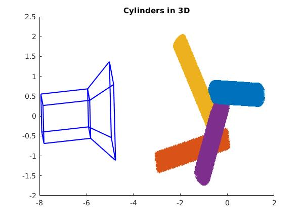
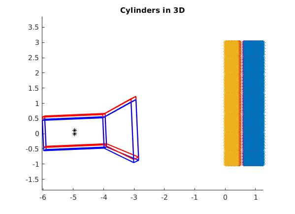

# minimal_solvers_conics

conics_synt.m simulate random conics and returns the rotation and translation error based on
the estimated camera matrix compared to the true one.

conics_synt_parallell.m simulate random parallell conics and returns the rotation and translation error based on
the estimated camera matrix compared to the true one.

